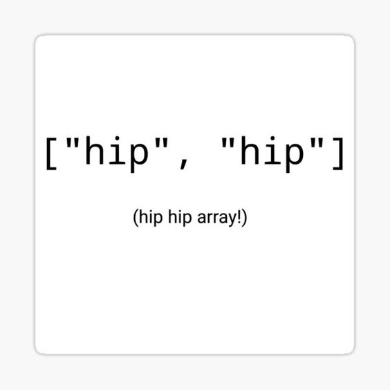

# CSC738_cybersecurity_assignment
# Task 1

## Contents
[Introduction](#introduction)

[How to use](#how-to-use)

[Code Creation and Implementation](#code-creation-and-implementation)

[Code configuration](#code-configuration)

## Introduction
[Go to Top](#top)

The android application presented here is a **hint hunt** of the UWC CAMS building. The concept revolves around the familiarization of the building, by using hints to navigate the labs and open areas. 

This is implemented using an Android AR application to find hidden clues in images posted around the building. 

## HOW TO USE: 
[Go to Top](#top)

1. The implementation of the application starts with the installation of the apk on an Android device.
2. Pan over the initial marker, (in this case the introductory CAMS image) to find the initial clue, and use these clues to navigate to the following markers.
3. Complete all of the clues in the **hint hunt** to find the hidden video, at the end.
4. Once this has been completed the user would've gained knowledge on lab location within the CAMS building.

# 

The proposed images are to be setup in the UWC CAMS lab, the assigned areas as described below:
  - Image1.png: CAMS introductory marker, at the entrance of the CAMS building.

  

  - Image2.png: Level 2 of CAMS building next to the large Window.

  

  - Image3.png: On the door of the Sunlab.
  
  

  - Image4.png: On the door of the AR/VR lab

  

#

## Code Creation and Implementation 
[Go to Top](#top)

The **hint hunt** AR application was created with a combination of Unity and Vuforia. The initial image markers were uploaded. The plane images were then added to act as clues to the markers. These hidden images are casted over the AR markers once the camera is panned over them.

## Code configuration 
[Go to Top](#top)

The AR application is configured with Unity IDE and Vuforia. The configuration for Unity is described in the 36 steps found below: 

Additionally the following Unity configuration is explained in the first 11 minutes of the video found at link - https://www.youtube.com/watch?v=gpaq5bAjya8.

Moreover, Vuforia is configured for the AR application using the video found at link - https://www.youtube.com/watch?v=RMOMTyfECTk.

1. Download unity (free version) by following instructions in webpage link: https://unity.com/download.
2. Start unity on your laptop operating system. A popup screen of unity hub will show up.
3. Select option ‘installs’ from the left sidebar.
4. Decide on a version of the unity editor but don’t select anything yet.
5. After deciding, click on the gear of the block displaying the version of the editor.
6. Thereafter, A popup screen of ‘Add modules for Unity 2021.1.5f1' will show.
7. At module screen, expand the dropdown called ‘PLATFORMS’.
8. Select checkboxes with descriptions: ‘Android SDK & NDK Tools’ and ‘OpenJDK’.
9. Go back to the sidebar of Unity hub.
10. Select option called ‘All templates’.
11. Set ‘editor version’, displayed above unity hub, to the version described by you in step 6.
12. Select ‘AR Core option’ and view the right sidebar.
13. Select Download template at right sidebar and provide a name for your project in the input box provided for the project name.
14. Select Create project button.
15. View the Unity Editor that was created.
16. View the menu bar of the unity editor.
17. Select ‘File’->’Project Settings’.
18. Select option ‘XR Plug-in Management’ inside of ‘Project Settings’.
19. Select android icon appearing in main window of ‘XR Plug-in Management’.
20. Under ‘Plug-in Providers’, Select ARCore checkbox.
21. View left sidebar of ‘Project Settings’ and select option ‘ARCore’.
22. Check if ARCore ‘Requirement’ and ‘Depth’ property is set to ‘Required’.
23. View left sidebar again but this time, select option called ‘Player’.
24. Under main window of ‘Player’, view ‘Graphics APIs’ window, select ‘OpenGLES2(Deprecated)’.
25. Delete ‘OpenGLES2(Deprecated)’ by clicking on the minus button.
26. View ‘Player’ main window then view ‘Identification title’.
27. Under ‘identification’ title, Unselect ‘Override Default Package Name’.
28. Under ‘identification’ title, Expand ‘Minimum API Level’ dropdown and select option ‘Android 8.0 ‘Oreo’' (API level 26).
29. Under ‘Configuration’ title, Select option ‘IL2CPP’ at Scripting Backend dropdown.
30. Under ‘Configuration’ title, under ’Target Architectures’ title select checkbox called ARM64 and unselect checkbox called ARMv7.
31. Close ‘Project settings’ window.
32. At top menu of unity ide, select option ‘Window’->’Package Manager’.
33. Under Features dropdown at left sidebar of ‘Package Manager’ window.
34. Select option ‘AR’ and ensure that the following six package are installed:
    1. AR Foundation
    2. ARKit XR Plugin
    3. ARCore XR Plugin
    4. Magic Leap XR Plugin
    5. ARKit Face Tracking
    6. OpenXR Plugin
35. Under dropdown ‘Packages - Unity’, Select dropdown ’XR Plugin Management’.
36. Lastly, select currently installed version 4.1.0 under 'Packages - Unity'. [CITED: https://www.youtube.com/watch?v=gpaq5bAjya8].

[Go to Top](#top)

